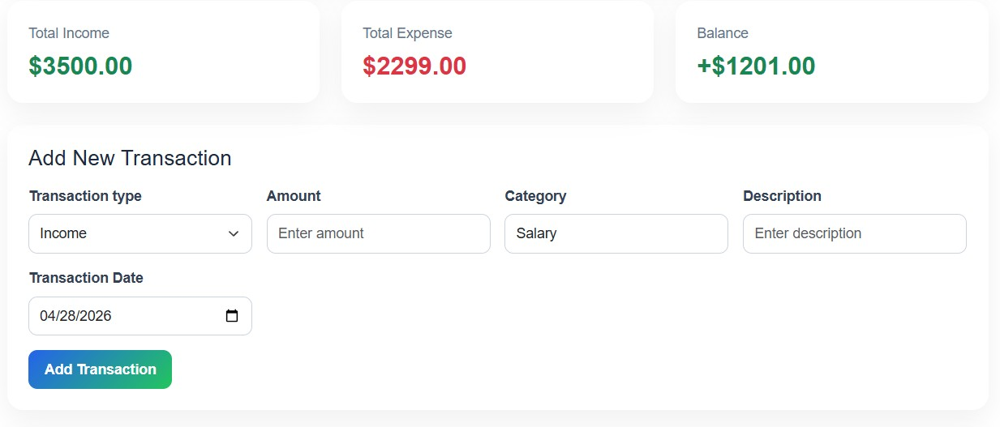

# SpendSense

## Project Description

SpendSense is a free cloud-based application for personal finance management that helps users track their income, expenditure, budgeting, and spending trends in an easily manageable way. Users can manage all their financial data through account books, manage monthly budgets per category, and analyze their transactions via interactive graphs and summaries. SpendSense also offers services like authentication, email validation, transactions, budget, and financial analysis modules which work collectively to ease the process of personal finance management.
SpendSense was developed as a Computer Science Capstone Project for CSC400 at Southern Connecticut State University.

---

# Team Members

| Team Member | Contributions |
|---|---|
| Reynaldo Garcia | Flask backend development, frontend development, Mailjet API email verification and password reset system, Bootstrap integration, Landing Page, Dashboard Page, budget feature implementation, financial charts using Chart.js, timeframe filtering system, deployment on Google Cloud VM, GitHub branch management and merges |
| Hualin Li | Supabase PostgreSQL integration, Flask backend development, user authentication system, Google Authentication integration, Account Books idea and implementation, CSV Import/Export feature, transaction CRUD functionality, environment configuration and production setup, User Profile Page, User Feedback Survey Form |
| Amir Pettigrew | Frontend development, application testing, HTML/CSS/JavaScript implementation, login and registration pages, dashboard assistance, User Profile page implementation, Navigation Pane implementation |

---

# Technologies Used

## Frontend
- HTML5
- CSS3
- Bootstrap 5.3.2
- JavaScript
- Jinja2 Templates
- Chart.js

## Backend
- Python
- Flask
- Flask-Login
- Flask-WTF / WTForms
- SQLAlchemy

## Database
- Supabase PostgreSQL

## APIs / Services
- Mailjet API
- Google Authentication API

## Tools
- GitHub
- Visual Studio Code
- Google Cloud Platform (GCP)

---

# Installation Instructions

## Prerequisites

Before running SpendSense locally, install the following:

- Python 3.x
- Git
- Virtual Environment support
- PostgreSQL or Supabase database connection

---

## Clone Repository

```bash
git clone https://github.com/your-repository-link.git
```

---

## Navigate to Project Folder

```bash
cd CSC-400-Project
```

---

## Create Virtual Environment

```bash
python -m venv venv
```

---

## Activate Virtual Environment

### Windows

```bash
venv\Scripts\activate
```

### Mac/Linux

```bash
source venv/bin/activate
```

---

## Install Dependencies

```bash
pip install -r requirements.txt
```

---

## Configure Environment Variables

Create a `.env` file and configure the following:

```env
SECRET_KEY=your_secret_key
DATABASE_URL=your_database_url
MAILJET_API_KEY=your_mailjet_key
MAILJET_SECRET_KEY=your_mailjet_secret
GOOGLE_CLIENT_ID=your_google_client_id
GOOGLE_CLIENT_SECRET=your_google_client_secret
APP_BASE_URL=http://127.0.0.1:5000
```

---

# Running the Application

## Start Flask Application

```bash
python app.py
```

---

## Open in Browser

Visit:

```text
http://127.0.0.1:5000
```

---

## Application Features

- User registration and login
- Google Authentication
- Email verification
- Dashboard analytics and charts
- Transaction management
- Budget tracking
- Account books
- User profile management
- CSV export functionality

---

# Deployment

SpendSense is deployed on a Google Cloud Platform (GCP) Virtual Machine running Ubuntu Linux.

## Deployment Stack

- Google Cloud VM
- Flask Application Server
- Supabase PostgreSQL Database
- Custom Domain: spendsenseapp.com

## Production URL

```text
https://spendsenseapp.com
```

---

# Screenshots

## Landing Page


**Description:**  
The landing page introduces users to SpendSense and provides access to login and registration functionality.

---

## Dashboard


**Description:**  
The dashboard displays financial summaries, charts, and budgeting analytics using interactive visualizations.

---

## Transactions Page



**Description:**  
The transactions page allows users to manage income and expense records with filtering and chart functionality.

---

# Future Improvements

Potential future improvements for SpendSense include:

- Mobile responsiveness improvements
- Advanced financial analytics
- Recurring transaction support
- Admin dashboard functionality
- Additional chart and reporting features

